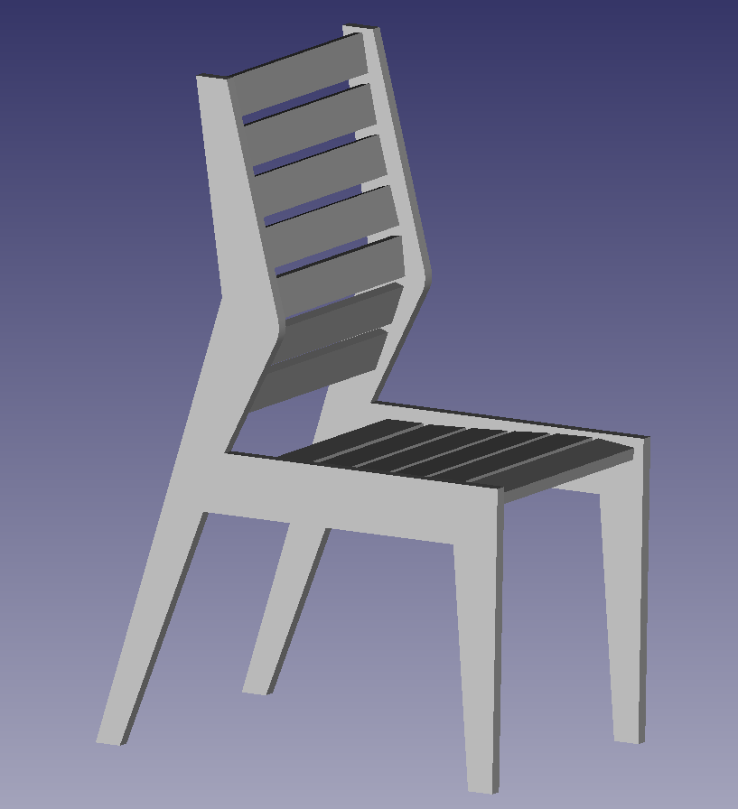

# It's a chair

Here's an attempt at making a chair 1. out of wood 2. with some sort of lumbar support.

At this stage, it has not been built and might be complete trash.

Plans are available as PDF. The file  is at true scale and sliced into A4 and letter sized chunks for printing. Make sure your printer doesn't scale the document to fit the page to get true measurements.

The slats for the seat and the back have 8mm holes marked for dowel joints, you may want to adjust if you want to use something else.
